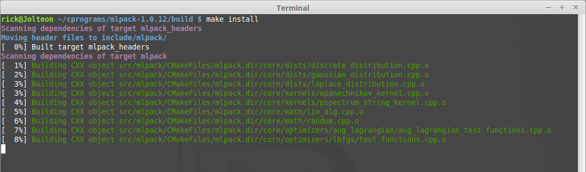
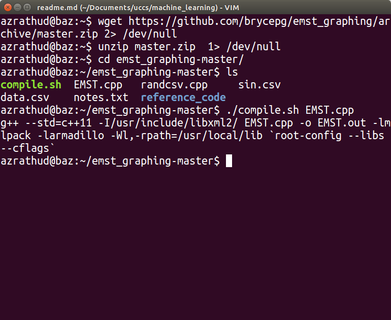

#Installation

## Install Mlpack

To install required packages:
`sudo apt-get install libboost-math-dev libboost-program-options-dev libboost-random-dev libboost-test-dev libxml2-dev libarmadillo-dev subversion doxygen cmake`

Download mlpack-1.0.12 from www.mlpack.org

create a `build` directory within the mlpack-1.0.12 directory and move into it

execute the `cmake ../` command

execute the `make` command to build mlpack-1.0.12 in the 'build' directory

execute the `sudo make install` command to install mlpack-1.0.12 to the '/usr/local/include' directory

### Linking with mlpack
When using mlpack remember to link mlpack with `-lmlpack` and also include libxml with `-I/usr/include/libxml2/`

## Installng Root Framework
run `sudo apt-get install root-system` to install Root, a data analysis framework used for graphics in this program.

Download the code at (http://github.com/brycepg/emst_graphing/ or use wget(shown later)

run `wget https://github.com/brycepg/emst_graphing/archive/master.zip` to download code
run `unzip master.zip` to unzip
`cd emst_graphing-master/` to enter directory.
run `./compile.sh EMST.cpp` to compile program.

The output binary will be names `EMST.out`. To run enter `./EMSt.out`

This will give you a emst graph using the default data.csv

To use another csv file, enter the file name as arguments

# Code

The idea behind this project was to take any two dimensional data set, generate a euclidean minimum spanning tree using mlpack, and then take that data structure and graph it using the ROOT data analysis framework.

## Mlpack Data structures

The mlpack library is a machine learning library based upon armadillo, a linear algebra library. All data is treated like a matrix. 

The program first takes a csv file of data points, imports these data points as a 2 dimensional data matrix, and then generates a matrix of indices of the data matrix that represent the edges to the euclidean minimum spanning tree of the data set. 

The function `compute_emst` does just that. It takes the program's arguments, determines what csv file to read, loads the into a matrix called `data` and then uses mlpack to generate the edges matrix. The resulting matrix classes are then returned in a struct to be used for drawing.

## Root framework
The root framework has a class for everything. The TApplication class is a monolithic, global class that acts as the recipient of all other root classes. 

The `draw_canvas` function determines the bounds of the canvas(graphing area, by taking in the data, extracting the min x and y values and using them as the range(think range of a graph) for the canvas. This includes interfacing with armadillo to extract column vectors from the matrices, and then using armadillo again to extract min/max from each column vector. There is also a buffer calculated and inserted into the range, which makes the graph more viewable. Axes are added to give an idea of what range of values the data contains.

The `draw_edges` draws lines connection each data point. To do this, it extracts each paired point using the indices stored in the `tree` matrix to access the actuall data value in the `data` matrix iteratively. The root framework provides `TLine` class which represents a 2D line between two coordinate points. The dynamic allocation of objects is not accompanied by a delete because the Root framework requires all objects to be drawn to be in memory when the `.Run()` method is called.(after which the program ends)

The `draw_nodes` function iteratively extracts coordinates from the `data` matrix, uses the `TMarker` class to represent a dot(Given the right marker shape number), and is drawn onto the screen.
